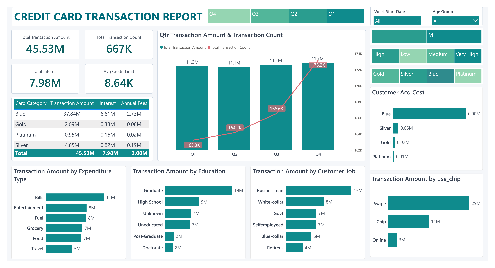
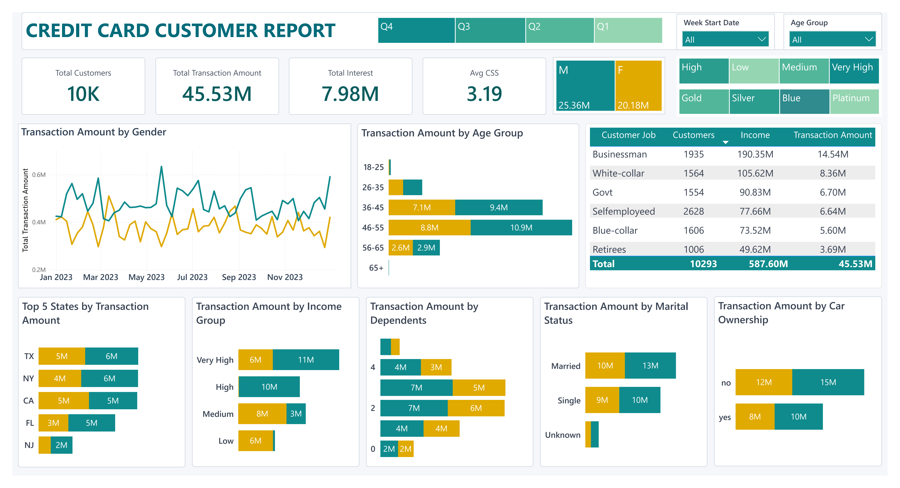

# 💳 Credit Card Customer & Transaction Analysis

## 📌 Project Overview

This project is an end-to-end **Data Analytics project** focused on analyzing credit card transactions and customer behavior.

The project follows a complete data analytics workflow:

**Raw CSV Data → Python Data Cleaning & Validation → PostgreSQL Analysis → Power BI Dashboard**

The analysis explores transaction performance, customer demographics, spending behavior, card categories, income groups, customer jobs, customer satisfaction, and other key business insights.

---

## 🎯 Business Objective

The objective of this project is to analyze credit card transaction and customer data to answer questions such as:

- What is the overall transaction performance?
- Which card categories generate the highest transaction amounts and interest?
- Which expenditure types contribute the most to transactions?
- How does transaction behavior vary by customer demographics?
- Which customer segments generate the highest transaction amounts?
- Which age, income, education, and job groups perform best?
- How do customer characteristics such as marital status, dependent count, and car ownership relate to transaction behavior?
- Which customer segments may require further attention based on delinquency rates?

---

## 🛠️ Tools & Technologies

- **Python** – Data cleaning, transformation, validation, and exploratory analysis
- **Pandas** – Data manipulation and analysis
- **NumPy** – Numerical operations
- **PostgreSQL** – Data storage and SQL analysis
- **pgAdmin** – Database management and query execution
- **Power BI** – Data visualization and interactive dashboard development
- **GitHub** – Project documentation and version control

---

# 📂 Dataset

The project uses two datasets.

# 📖 Data Dictionary

## 👤 Customer Details Table

| Column | Description |
|---|---|
| `client_num` | Unique identification number assigned to each customer. |
| `customer_age` | Age of the customer. |
| `gender` | Gender of the customer, such as Male or Female. |
| `dependent_count` | Number of dependents associated with the customer. |
| `education_level` | Highest education level of the customer. |
| `marital_status` | Marital status of the customer, such as Married, Single, or Unknown. |
| `state_cd` | State code representing the customer's location. |
| `zipcode` | ZIP code associated with the customer. |
| `car_owner` | Indicates whether the customer owns a car. |
| `house_owner` | Indicates whether the customer owns a house. |
| `personal_loan` | Indicates whether the customer has a personal loan. |
| `contact` | Preferred or available contact method of the customer. |
| `customer_job` | Occupation or job category of the customer. |
| `income` | Annual income of the customer. |
| `cust_satisfaction_score` | Customer satisfaction score. |

---

## 💳 Credit Card Details Table

| Column | Description |
|---|---|
| `client_num` | Unique customer identification number used to connect with the customer details table. |
| `card_category` | Type or category of credit card, such as Blue, Silver, Gold, or Platinum. |
| `annual_fees` | Annual fee charged for the credit card. |
| `activation_30_days` | Indicates whether the card was activated within 30 days. |
| `customer_acq_cost` | Cost incurred by the company to acquire the customer. |
| `week_start_date` | Starting date of the week for which the transaction data is recorded. |
| `week_num` | Week number associated with the transaction record. |
| `qtr` | Quarter in which the transaction occurred, such as Q1, Q2, Q3, or Q4. |
| `current_year` | Year associated with the transaction record. |
| `credit_limit` | Maximum credit amount available to the customer. |
| `total_revolving_bal` | Outstanding credit card balance carried from one billing cycle to the next. |
| `total_trans_amt` | Total monetary value of transactions made by the customer. |
| `total_trans_ct` | Total number of transactions made by the customer. |
| `avg_utilization_ratio` | Average percentage of the available credit limit being utilized. |
| `use_chip` | Method used to complete the transaction, such as Chip, Swipe, or Online. |
| `exp_type` | Category of customer expenditure, such as Bills, Entertainment, Fuel, Grocery, Food, or Travel. |
| `interest_earned` | Total interest earned from the customer. |
| `delinquent_acc` | Indicates whether the customer's account is delinquent. A value of 1 generally represents a delinquent account, while 0 represents a non-delinquent account. |

Both datasets are connected using the **client_num** column.

---

# 🐍 Python: Combine Dataset, Data Cleaning & Validation

The raw dataset was provided in multiple CSV files. Each logical dataset was split into two parts:

- Credit card data: cc_details and cc_add
- Customer data: cust_details and cust_add

The files belonging to the same dataset were combined using Pandas pd.concat()

Afer that Python was used to clean, validate, and prepare the datasets before importing them into PostgreSQL.

## Data Cleaning Steps

The following steps were performed:

- Loaded the raw CSV datasets using Pandas.
- Standardized column names by converting them to lowercase and snake_case format.
- Checked and handled missing values.
- Checked for duplicate records.
- Validated and corrected data types.
- Converted the `week_start_date` column to datetime format.
- Checked numerical data using descriptive statistics.
- Analyzed categorical columns and unique values.
- Identified potential outliers using the IQR method.
- Reviewed outliers and retained valid business values.
- Created customer segmentation columns, including:
  - Age Group
  - Income Group
- Validated the `client_num` values between both datasets.

## Data Validation Results

After cleaning and validation:

- Unique clients in Credit Card Details: **10,293**
- Unique clients in Customer Details: **10,293**
- Missing values: **0**
- Duplicate rows: **0**
- Clients only in Credit Card Details: **0**
- Clients only in Customer Details: **0**

This confirmed that both datasets contained the same customer IDs and could be successfully connected using `client_num`.

---

# 🗄️ PostgreSQL: Data Analysis

The cleaned datasets were imported into PostgreSQL as two separate tables:

- `cust_details_cleaned`
- `cc_details_cleaned`

The tables were intentionally kept separate to perform relational analysis and practice SQL `JOIN` operations using the `client_num` column.

## SQL Concepts Used

The analysis included:

- `SELECT`
- `WHERE`
- `GROUP BY`
- `ORDER BY`
- Aggregate functions
- `CASE WHEN`
- `INNER JOIN`
- Common Table Expressions (CTEs)
- Customer segmentation
- Ranking and comparison analysis

## Analysis Performed

The SQL analysis focused on:

### 📊 Overall Performance

- Total Customers
- Total Transaction Amount
- Total Transaction Count
- Average Credit Limit
- Total Interest Earned

### 💳 Card Category Analysis

Analyzed transaction performance, interest earned, annual fees, and credit limits across:

- Blue
- Silver
- Gold
- Platinum

### 💰 Expenditure Type Analysis

Analyzed transaction behavior across different expenditure categories, including:

- Bills
- Entertainment
- Fuel
- Grocery
- Food
- Travel

### 👥 Customer Segmentation Analysis

Analyzed transaction performance based on:

- Gender
- Age Group
- Income Group
- Education Level
- Customer Job
- Marital Status
- Dependent Count
- Car Ownership
- House Ownership

### ⚠️ Delinquency Analysis

Calculated the overall delinquency rate and analyzed delinquency across:

- Customer Job
- Age Group
- Income Group

---

# 📊 Power BI Dashboard

The cleaned and analyzed data was used to create an interactive Power BI dashboard consisting of two report pages.

In this we have created different measures and calcualted columns
- Total Transaction Amount
- Total Customers
- Average Customer Satisfaction Score(CSS)
- Average Credit Limit
- Total Transaction Count

And calculated columns like
- Income Group
- Age Group
- Income Group Sort

## 💳 Transaction Report

The Transaction Report provides insights into:

- Total Transaction Amount
- Total Transaction Count
- Total Interest Earned
- Average Credit Limit
- Quarterly Transaction Trends
- Card Category Performance
- Expenditure Type Analysis
- Education-Level Analysis
- Customer Job Analysis
- Transaction Method Analysis
- Customer Acquisition Cost

## 👤 Customer Report

The Customer Report focuses on customer demographics and segmentation, including:

- Total Customers
- Total Transaction Amount
- Total Interest
- Average Customer Satisfaction Score
- Transaction Trends by Gender
- Age Group Analysis
- Top States by Transaction Amount
- Income Group Analysis
- Dependent Count Analysis
- Marital Status Analysis
- Car Ownership Analysis
- Customer Job Performance

The dashboard includes interactive slicers for:

- Quarter(using Treemap)
- Week Start Date(slicer)
- Age Group(slicer)
- Gender(Treemap)
- Income Group(Treemap)
- Card Category(Treemap)

---

# 📸 Dashboard Preview

## Transaction Report

## Customer Report

---

# 📈 Key Insights

The analysis revealed several important business insights:

- **Blue card customers generated the highest overall transaction activity and interest earned.**
- **Bills contributed the highest transaction amount among expenditure categories.**
- **Male customers generated higher transaction amounts compared to female customers.**
- **Graduate customers were among the strongest-performing education groups.**
- **Businessman customers generated the highest transaction amount among customer job categories.**
- **Married customers showed higher transaction activity than single customers.**
- **Customers in the 46–55 age group demonstrated strong transaction performance.**
- **The Very High income group generated the highest transaction activity.**
- **Customers without a car generated higher transaction amounts compared to car owners.**
- **The overall delinquency rate was approximately 6.06%.**
- **The 18–25 age group showed the highest delinquency rate among the analyzed age segments.**
- **Government employees showed a relatively high delinquency rate among job categories.**

## Author

**Imran Ansari**

Data Analytics Portfolio Project

**Tools:** Python | PostgreSQL | SQL | Power BI | Excel
